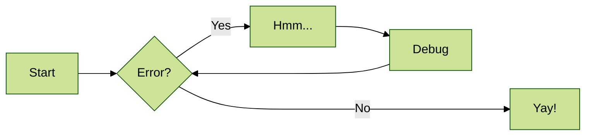

# example docs

This is a basic example of documentation.

## embeded Mermaid example:

```mermaid
%%{init: {'theme': 'forest'}}%%
graph LR
  A[Start] --> B{Error?};
  B -->|Yes| C[Hmm...];
  C --> D[Debug];
  D --> B;
  B ---->|No| E[Yay!];
```

## Graphviz example:
digraph G {
    rankdir=LR
    Earth [peripheries=2]
    Mars
    Earth -> Mars
}